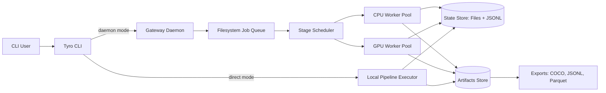

# Winnow Architecture Design

## 1. Purpose

Winnow is an agentic data preparation, pre-processing, and annotation toolkit for image streams captured as ordered frame folders. It must:

- Process large ordered image sequences from local disk.
- Compute quality and curation metrics (blur, darkness, duplicates, idle periods, etc.).
- Run highly parallel pipelines while avoiding duplicate work.
- Support configurable pipelines as Python dataclasses.
- Offer both direct CLI execution and an installable long-running gateway/daemon for orchestration.
- Support automatic annotation using large pretrained models.

## 2. Domain Constraints

- Input unit: one folder per camera stream recording.
- Frame naming pattern: `image_0`, `image_1`, ..., monotonic ascending order.
- Sequence order is semantically important (temporal analytics and idle period detection).
- Stream sizes can be large (thousands of images), so all compute must be chunked/batched and checkpointable.

## 3. Design Principles

- Deterministic, idempotent pipeline execution.
- Stage-level checkpointing for restartability and work deduplication.
- Multiprocess CPU utilization and optional GPU workers.
- Composable stage graph with typed configs (dataclasses).
- Minimal operational surface for v1: no SQL database and no HTTP service requirement.

### Non-Goals (v1)

- Real-time online video stream ingestion.
- Cloud-distributed scheduler across multiple machines.
- Full labeling UI (export/import and API hooks only).

## 4. High-Level Architecture



### Runtime Modes

- Direct mode: CLI process executes pipeline locally for single-machine workflows.
- Daemon mode: installable local gateway service owns queueing, scheduling, retries, and worker orchestration.

## 5. Core Components

### 5.1 CLI Layer (Tyro)

Use typed dataclass configs as the single source of truth for both local run and daemon submission.

- `winnow run ...` executes locally.
- `winnow gateway ...` manages daemon lifecycle.
- `winnow submit ...` writes jobs to daemon queue.
- `winnow inspect ...` inspects job/stage/artifact states.
- `winnow export ...` emits training-ready datasets.

Tyro supports nested dataclasses and subcommand unions, which maps cleanly to this command model.

### 5.2 Gateway Daemon

Responsibilities:

- Watch local queue directories for submitted jobs.
- Normalize/validate pipeline configs.
- Expand jobs into stage tasks and batches.
- Schedule tasks to CPU/GPU worker pools based on resource requirements.
- Track stage and artifact states in the file-backed state store.
- Retry failed tasks with bounded policy.

Implementation direction:

- Single local process with event loop + scheduler thread.
- Worker execution via `ProcessPoolExecutor` (CPU) and dedicated GPU worker processes.
- Local control files for status and lifecycle (`pid`, `heartbeat`, `lock`).

### 5.3 Pipeline Engine

A pipeline is a DAG of stages where each stage declares:

- input artifact types,
- output artifact types,
- partitioning strategy,
- resource requirements,
- deterministic cache key function.

Stages run over frame batches (`BatchRef`) rather than entire streams by default.

### 5.4 State and Artifact Storage

- State store: filesystem-backed metadata as JSON/JSONL/msgpack snapshots.
- Artifact store: content-addressed filesystem tree under workspace cache root.
- Large tabular outputs: Parquet.
- Annotation outputs: JSONL and export formats (COCO adapter in v1).

No SQL database is required in v1.

## 6. Data Model (File-Backed)

### 6.1 Entity Definitions

- `Stream`: one folder ingestion unit.
- `Frame`: single indexed image in stream.
- `Batch`: contiguous frame index interval (e.g., 512 frames).
- `Job`: one pipeline execution request.
- `StageRun`: execution state for stage on a given partition.
- `Artifact`: immutable output of a stage run, content-addressed.

### 6.2 State Directory Layout

```text
.winnow/
  state/
    v1/
      jobs/
        <job_id>.json
      queue/
        pending/
        running/
        done/
        failed/
      streams/
        <stream_id>/
          stream.json
          frames.jsonl
      stages/
        <stage_name>/
          <stream_id>/
            <batch_start>_<batch_end>/
              <cache_key>.json
      events/
        events-YYYYMMDD.jsonl
      snapshots/
        index.msgpack
      runtime/
        gateway.pid
        gateway.heartbeat
  artifacts/
    sha256/
      ab/
        <full_hash>/
          artifact.bin
          artifact.meta.json
```

### 6.3 Record Types

- `job.json`: status, config hash, timestamps, stream refs.
- `frames.jsonl`: ordered frame metadata (`frame_idx`, path, hash, width, height).
- `stage checkpoint`: state, attempt count, input hash refs, output artifact refs, error payload.
- `events.jsonl`: append-only operational events for diagnostics/rebuild.

### 6.4 State Versioning (No Migrations)

- State root is versioned (`state/v1`, `state/v2`, ...).
- Breaking format changes create a new state version directory.
- Optional one-shot import tool can translate `vN -> vN+1`; no migration framework in runtime.

## 7. Idempotency and Stage Tracking

Idempotency rule: if `(stage_name, partition, cache_key)` checkpoint already exists in `SUCCEEDED` state with valid output artifacts, skip re-computation.

Cache key inputs:

- stage name + semantic version,
- stage code hash,
- normalized stage config,
- upstream artifact hashes,
- execution environment signature (optional for strict reproducibility).

Failure handling:

- mark checkpoint `FAILED` with traceback snippet.
- bounded retries by policy.
- write outputs to temporary paths then atomically `os.replace(...)` into final locations.

Recovery behavior:

- daemon startup sweep requeues stale `running` tasks based on heartbeat timeout.
- checkpoint files are authoritative for what is already complete.

## 8. Parallelism Strategy

### 8.1 Partitioning

- Primary partition axis: contiguous frame batches (`N` frames).
- Secondary axis for expensive global stages (dedup indexing) by stream shard.

### 8.2 Worker Pools

- CPU pool for I/O decode, blur/dark metrics, perceptual hashing, temporal diffs.
- GPU pool for embedding generation and automatic annotation stages.

### 8.3 Backpressure

- bounded in-flight tasks per pool.
- dynamic batch size tuning based on observed stage latency and memory pressure.

### 8.4 I/O Controls

- Prefer `opencv`/`Pillow-SIMD` decode in workers.
- Avoid moving full tensors through scheduler process.
- Keep artifact and state writes local and atomic.

## 9. Pipeline Configuration (Dataclasses)

```python
from dataclasses import dataclass, field
from typing import Literal

@dataclass
class IngestConfig:
    root: str
    glob: str = "*.jpg"
    strict_sequence: bool = True

@dataclass
class BlurMetricConfig:
    method: Literal["laplacian_var"] = "laplacian_var"
    threshold: float = 80.0

@dataclass
class DuplicateMetricConfig:
    phash_hamming_threshold: int = 6
    embedding_model: str = "clip-vit-large-patch14"
    ann_index: Literal["faiss_flat", "faiss_ivf"] = "faiss_ivf"

@dataclass
class AnnotationConfig:
    enabled: bool = False
    detector: str = "d-fine"
    segmenter: str = "sam2"
    min_score: float = 0.25

@dataclass
class PipelineConfig:
    ingest: IngestConfig
    blur: BlurMetricConfig = field(default_factory=BlurMetricConfig)
    duplicate: DuplicateMetricConfig = field(default_factory=DuplicateMetricConfig)
    annotation: AnnotationConfig = field(default_factory=AnnotationConfig)
    batch_size: int = 512
```

All CLI entry points should accept these configs via Tyro.

## 10. Feature Architecture

### 10.1 Ingestion and Sequence Validation

- Scan folder and parse frame index from filename suffix.
- Verify monotonic sequence and detect gaps.
- Persist frame catalog with deterministic ordering.
- Compute lightweight file hash (BLAKE3 preferred) for fast identity checks.

### 10.2 Blur Metric

Default metric:

- Variance of Laplacian per frame (fast baseline).
- Store raw score and binary quality flag from configurable threshold.

Extensible:

- plugin hook for no-reference IQA models later.

### 10.3 Darkness / Exposure Metric

- Compute luma histogram and mean/percentile luminance.
- Flag underexposed frames via configurable percentile threshold.

### 10.4 Duplicate Detection

Two-stage approach:

1. Fast candidate generation with perceptual hash (`pHash`) + Hamming distance.
2. Optional semantic near-duplicate verification using CLIP embeddings + FAISS ANN.

Outputs:

- duplicate clusters with representative frame.
- per-frame `duplicate_group_id` and confidence.

### 10.5 Idle Period Detection (Temporal)

Use sequential nature explicitly:

- compute frame-to-frame motion proxy (abs diff or optical-flow magnitude).
- smooth over sliding window.
- mark idle segments when motion score stays below threshold for duration.

Result:

- interval table `(start_idx, end_idx, idle_score)` per stream.

### 10.6 Automatic Annotation

Model abstraction:

- `DetectorAdapter` (boxes + class text + confidence)
- `SegmenterAdapter` (optional masks)
- `CaptionerAdapter` (optional semantic captions)

Suggested default pipeline:

- object detection (Pretrained D-FINE)
- optional segmentation refinement (SAM 2)
- serialize outputs to canonical Winnow annotation schema
- export adapters for COCO

Agentic behavior (v1.5+):

- policy selects uncertain frames for re-annotation with larger model.
- optional human-review queue export for low-confidence predictions.

## 11. CLI Surface

- `winnow run --config pipeline.py:cfg --input /data/stream_001`
- `winnow submit --config pipeline.py:cfg --input /data/stream_001`
- `winnow inspect job --id JOB_ID`
- `winnow inspect stream --path /data/stream_001`
- `winnow export --job JOB_ID --format coco --out /tmp/dataset`
- `winnow gateway start|stop|status|install-service`

`submit` and `inspect` read/write local queue/state files by default.

## 12. Repository Layout

```text
winnow/
  architecture/
    winnow-architecture.md
  src/winnow/
    __init__.py
    cli/
      app.py
      commands_run.py
      commands_gateway.py
      commands_inspect.py
      commands_export.py
    config/
      schema.py
      loader.py
    gateway/
      daemon.py
      scheduler.py
      control.py
      service_install.py
    pipeline/
      stage.py
      dag.py
      executor.py
      registry.py
    workers/
      pool.py
      task_runner.py
      gpu_runner.py
    ingest/
      scanner.py
      sequence.py
    metrics/
      blur.py
      darkness.py
      duplicates.py
      idle.py
    annotation/
      adapters/
        d_fine.py
        sam2.py
      orchestrator.py
      schema.py
    storage/
      state_store.py
      queue.py
      checkpoints.py
      events.py
      snapshots.py
      artifacts.py
      atomic.py
    export/
      coco.py
      yolo.py
    observability/
      logging.py
      metrics.py
```

## 13. Observability and Operability

- Structured logs with job/stage/task correlation IDs.
- Metrics: queue depth, task latency, stage throughput, retries, failed stage counts.
- Event journal for post-mortem and state rebuild.
- `winnow gateway status` should include worker pool health and backlog.

Service installation:

- Linux: generate `systemd` unit file.
- macOS: generate `launchd` plist.
- Both should point to persistent state/artifact roots and log path.

## 14. Security and Data Integrity

- Local-only operation by default (no exposed network endpoint required).
- Optional control token for privileged command operations.
- Artifact checksums verified before marking stage success.
- Immutable artifact paths keyed by content hash.

## 15. Phased Delivery Plan

### Phase 1: Core Pipeline Engine

- Ingestion, sequence validation, blur/darkness metrics.
- File-backed stage tracking + idempotent executor.
- Local `winnow run` command.

### Phase 2: Gateway and Parallel Scheduling

- Daemon loop + worker pools + retries.
- `winnow submit/inspect/gateway` commands.
- Service install commands for Linux/macOS.

### Phase 3: Duplicate and Idle Analytics

- pHash duplicates and temporal idle detection.
- FAISS-based embedding verification optional stage.

### Phase 4: Automatic Annotation

- model adapters, annotation schema, COCO export.
- uncertainty-driven re-annotation policy hooks.

### Phase 5: Hardening

- observability stack, benchmark suite, state versioning/import tooling.

## 16. External References

- Tyro docs: <https://brentyi.github.io/tyro/>
- Python `concurrent.futures` docs: <https://docs.python.org/3/library/concurrent.futures.html>
- Python `multiprocessing` docs: <https://docs.python.org/3/library/multiprocessing.html>
- Python `os.replace` docs (atomic rename): <https://docs.python.org/3/library/os.html#os.replace>
- OpenCV image hash module: <https://docs.opencv.org/4.x/d4/d93/group__img__hash.html>
- FAISS documentation: <https://faiss.ai/>
- SAM 2 repository: <https://github.com/facebookresearch/sam2>
- Systemd unit docs: <https://www.freedesktop.org/software/systemd/man/systemd.service.html>
- Apple launchd docs: <https://developer.apple.com/library/archive/documentation/MacOSX/Conceptual/BPSystemStartup/Chapters/CreatingLaunchdJobs.html>
